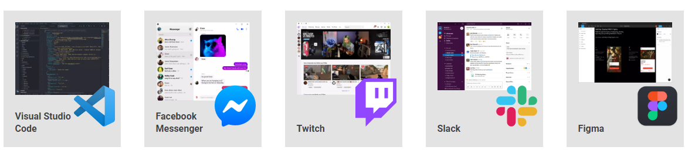

# Tutorial
## Introduction
This tutorial aims to go over both Electron and React.js in an attempt to help you set up a desktop application built on electron.js with the frontend being done using React.

This tutorial assumes you already have node and npm installed and running. To ensure both of them are running, run the following commands
``` PS
node -v
npm -v
```
These commands run versions and will check if they are present on the computer. The version of Node.js doesn't amtter since Electron embeds Node.js into its binary meaning that the version running on your computer doesn't matter.

--- 
## Electron


**What is Electron?**

Electron.js is a backend builder which enables you to build applications. Many common desktop apps such as Visual Studio Code, Slack, Messenger are build based off of Electron.



Electron relies on Chromium and Node.js and creates cross-platform applications with no native development required. Let's go over some important things to better understand React.

&nbsp;

**Processes In Electron**

Electron has a multi-process architecture (inherited from Chromium) which means that it's very similar to modern web browsers. Having a single process could mean that one website crashing would lead to the crash of an entire browser but with multiple processes, you can have multiple different things going on.

In Chrome, each tab renders its own processs and a signle browser controls these processes. The Chrome process manager manages multiple of processes. 


App developers have control of the renderer and main processes. 

&nbsp;

**The Main Process**

The Main process is responsible for creating instances of `BrowserWindow` and different events we observe in Electron. It registers global shortcuts, creates native menus and dialogs and responds to auto-update events, etc.

The main purpose of this is to create and manage application windows with the `BrowserWindow` module. For ever instance of the `BrowserModule` class, it creates an application window that loads a web page in a spearate renderer process. 
``` JS
//main.js
const { BrowserWindow } = require('electron')

const win = new BrowserWindow({ width: 800, height: 1500 })
win.loadURL('https://github.com')

const contents = win.webContents
console.log(contents)
```
When a `BrowserWindow` isntance is destroyed, it's corresponding renderer process gets terminated as well.

The main process also controls your application's lifestyle through Electron's `app` module. This allows you to add custom behaviors. The main process also has custom APIs that allow you to interact with the OS. More information can be found [here](https://www.electronjs.org/docs/latest/api/app).


&nbsp;

**The Renderer Process**

For each open `BrowserWindow`, there is a separate renderer process which renders the web content and the code running in this will run similar to how it would run on Chrome.

Renderer processes have no direct access to Node.js APIs (including ones like `require`) and you will need same bundler toolchains (ex `webpack` or `parcel`) that you use on the web.

&nbsp;

**Preload Scripts**

These are the scripts that run in a renderer process before the web content begins to load. They run in the context of the renderer but have more privileges by having access to Node.js APIs. A preload script can be attached to the main process in the `BrowserWindow` constructor's `webPreferences` option.

```JS
//main.js
const { BrowserWindow } = require('electron')
//...
const win = new BrowserWindow({
  webPreferences: {
    preload: 'path/to/preload.js'
  }
})
//...
```
The preload script shares a global `Window` interface with renderers and can access Node.js APIs, enabling enhancement of the renderer by exposing arbitary APIs in the `window` global for the web contents to use. 

Preload scripts share a `window` global with the renderer they're attached to but do not directly attach any variables from preload script to `window` due to the `contextIsolation` default.
```JS
//preload.js
window.myAPI = {
  desktop: true
}
```
``` JS
//render.js
console.log(window.myAPI)
// => undefined
```
Context Isolation means preload scripts are isolated from renderer's main function to prevent leaking APIs to the web content of the code. `contextBridge` allows for APIs to be used securely.
``` JS
//preload.js
const { contextBridge } = require('electron')

contextBridge.exposeInMainWorld('myAPI', {
  desktop: true
})
```
``` JS
//renderer.js
console.log(window.myAPI)
// => { desktop: true }
```
This is helpful for 2 main reasons:
1. It exposes `ipcRenderer` helpers to renderer which allows use of inter-process communication to trigger main process tasks from the renderer (and vice versa) 
2. It allows you to add custom properties to the renderer's `window` global that can be used for desktop-only logic on the web client's side which can be really helpful when developer Electron wrappers for existing web apps.

&nbsp;


**Helpful links**
- **[Electron Website](https://www.electronjs.org/)**

- **[Electron Documentation](https://www.electronjs.org/docs/latest)**

- **[Electron Github](https://github.com/electron/electron)**

--- 

## React
**What is React?**
React is a front-end library for building user interfaces. It's open-source and is maintained by Meta. This is not a React tutorial so this will not delve too deep into attempting to explain React.


**Helpful links**
- **[React Website](https://reactjs.org/)**
- **[React Documentation](https://reactjs.org/docs/getting-started.html)**
--- 

## Starting off (Setting Up Electron w/o React)
**This turtorial is based around Electron quickstart. The code is under method 1.**

The first part of this tutorial is dedicated to explaining how you would set up Electron. This will only allow you to work with HTML/CSS/JS and not React. We need to start off by creating a folder and initializing an npm package.
``` PS
mkdir Method1
cd Method1
npm init
```
Within `package.json`, we need to make a couple of important changes:
- `entry point` should be `main.js`
- `author` and `description` are required but can be anything
So it can end up looking something like this:
``` JSON
{
  "name": "my-electron-app",
  "version": "1.0.0",
  "description": "Hello World!",
  "main": "main.js",
  "author": "Jane Doe",
  "license": "MIT"
}
```
Finally, in the `scripts` field of `package.json`, we add a `start` command like:
``` JSON
{
  "scripts": {
    "start": "electron ."
  }
}
```
The `start` command will let you open your app in development mode. For now this will not run anything.

&nbsp;


**Run the Main Process**

The `main` script is the entry point of the Electron application and it runs in the Node.js environment. Like it's name suggests, it controls the main process and is responsible for controlling the app's lifecycle, displaying native interfaces, performing privileged operations, and managing renderer processes. 

In the root folder, you'll need to create a few files:
- index.html
- main.js
- preload.js

index.html contains the content that will be loaded onto the window we create. This is the html that will be rendered.
```html
<--index.html-->
<!--index.html-->

<!DOCTYPE html>
<html>
  <head>
    <meta charset="UTF-8">
    <!-- https://developer.mozilla.org/en-US/docs/Web/HTTP/CSP -->
    <meta http-equiv="Content-Security-Policy" content="default-src 'self'; script-src 'self'">
    <title>Hello World!</title>
  </head>
  <body>
    <h1>Hello World!</h1>
    We are using Node.js <span id="node-version"></span>,
    Chromium <span id="chrome-version"></span>,
    and Electron <span id="electron-version"></span>.
  </body>
</html>
```

&nbsp;

**Opening your web page in a browser window**

We will load the web page into an application window using the following Electron modules:
- The `app` module controls the app's event lifecycle
- The `BrowserWindow` module is reponsible for creating and managing app windows
Since main.js is running in the Node environment, we can use Node modules such as require. 

In Node.js, `require()` is a native function that allows you to bring in external separate files and in this case, we will use it to bring in Electron.
```JS
const { app, BrowserWindow } = require('electron')
```
Then, we add a function called `createWindow` that loads `index.html` into a new `BrowserWindow` instance. 
``` JS
const createWindow = () => {
  const win = new BrowserWindow({
    width: 960,
    height: 720
  })

  win.loadFile('index.html')
}
```
Next, we'll need to actually open the function. Browser windows can only be created after the `app` module's `ready` event is fired. To wait for this, we see the `app.whenReady()` API which upon activating, we can use to start the window.
``` JavaScript
app.whenReady().then(() => {
  createWindow()
})
```

&nbsp;

**Manage your window's lifecycle**

You need to use additional boilerplate code for the application to work better on the specific platforms/OS. In general, you can use the `process` global's `platform` attribute to run code specifically for certain operating systems.

On Windows and Linux, exiting all windows generally quits an application entirely. To implement this, listen for the `app` module's `window-all-closed` event, and call `app.quit()`if the user is not on macOS (`darwin`).
``` JS
app.on('window-all-closed', () => {
  if (process.platform !== 'darwin') app.quit()
})
```
Linux and Windows apps quit when there are no windows open and they generally continue running even without any windows open, and activating the app when no windows are avaialble should open a new one.

The code listens for the `app` module's `activate` event, and call your existing `createWindow()` method if no browser windows are open. Windows cannot be created before the `ready` event so you have to listen for `activate` events after your app is initialized. The code will look as such:
``` JS
app.whenReady().then(() => {
  createWindow()

  app.on('activate', () => {
    if (BrowserWindow.getAllWindows().length === 0) createWindow()
  })
})
```

&nbsp;

**Access Node.js from the renderer with a preload script**

We attach a preload script to your renderer comes in handy. A preload script runs before the renderer process is loaded and has access to both rendere globals (e.g. `window` and `document`) and a Node.js environment.

We create a new script called `preload.js` and add in the following code:
``` JS
window.addEventListener('DOMContentLoaded', () => {
  const replaceText = (selector, text) => {
    const element = document.getElementById(selector)
    if (element) element.innerText = text
  }

  for (const dependency of ['chrome', 'node', 'electron']) {
    replaceText(`${dependency}-version`, process.versions[dependency])
  }
})
```
This code accessed the Node.js `process.versions` and runs a basic `replaceText` helper function to insert the version numbers into the HTML document. 

To attach this script to your renderer process, pass in the path to your preload script to the `webPreferences.preload` option in your existing `BrowserWindow` constructor.
``` JS
// include the Node.js 'path' module at the top of your file
const path = require('path')

// modify your existing createWindow() function
const createWindow = () => {
  const win = new BrowserWindow({
    width: 800,
    height: 600,
    webPreferences: {
      preload: path.join(__dirname, 'preload.js')
    }
  })

  win.loadFile('index.html')
}
// ...
```
In this, there are two important concepts from Node.js here.
- The `_dirname_` string points to the path of the currently executing script (in this case, your project's root folder)
- The `path.join` API joins multiple path segments together, creating a combined path string that works across all platforms

&nbsp;

**Add functionality to your web contents**

To add additional functionality to the web contents, you need to add scripts to the renderer process. The renderer process runs in a normal web environment, you can add a `<script>` tag right before your `index.html` file's closing `</body>` tag to include any arbitrary scripts you want:
``` html
<script src="./renderer.js"></script>
```
The code contained in `renderer.js` can use JavaScript APIs and tooling you use for typical front-end development.

&nbsp;

**Package and distribute your application**

The best way to package and distribute Electron apps is through the use of Electron Forge which is a complete tool for creating, publishing, and installing modern Electron applications. 

1. Add Electron Forge as a development dependency of your app, and use its `import` command to set up Forge's scaffolding:
``` PS
npm install --save-dev @electron-forge/cli
npx electron-forge import

✔ Checking your system
✔ Initializing Git Repository
✔ Writing modified package.json file
✔ Installing dependencies
✔ Writing modified package.json file
✔ Fixing .gitignore

We have ATTEMPTED to convert your app to be in a format that electron-forge understands.

Thanks for using "electron-forge"!!!
``` 
2. Create a distributable using Forge's `make` command:

``` PS
npm run make

> my-electron-app@1.0.0 make /my-electron-app
> electron-forge make

✔ Checking your system
✔ Resolving Forge Config
We need to package your application before we can make it
✔ Preparing to Package Application for arch: x64
✔ Preparing native dependencies
✔ Packaging Application
Making for the following targets: zip
✔ Making for target: zip - On platform: darwin - For arch: x64
```
Electron Forge will create the `out` folder where the pacakge will be located
``` PS
// Example for macOS
out/
├── out/make/zip/darwin/x64/my-electron-app-darwin-x64-1.0.0.zip
├── ...
└── out/my-electron-app-darwin-x64/my-electron-app.app/Contents/MacOS/my-electron-app
``` 


&nbsp;

---

## Full Setup of Electron + React App
Now that we have a better idea of how Electron works, we're going to create an Electron App that makes use of React. Since Electron can make use of JavaScript, it'll be able to make use of Front-End programs like React, Vue, Angular, etc.

&nbsp;

**Starting off**

To start off, we'll create a folder with a React app inside of it. It is easier to start off with React and move onto implementing in Electron rather than vice versa.

For this tutorial, the folder we create it in will be called method2. We can create the folder first and then implement React into it or we can get React to do it for us.

If we create the folder method2 first, we can add React to that folder using:
``` PS
npx create-react-app .
``
`


&nbsp;


&nbsp;

&nbsp;

&nbsp;

